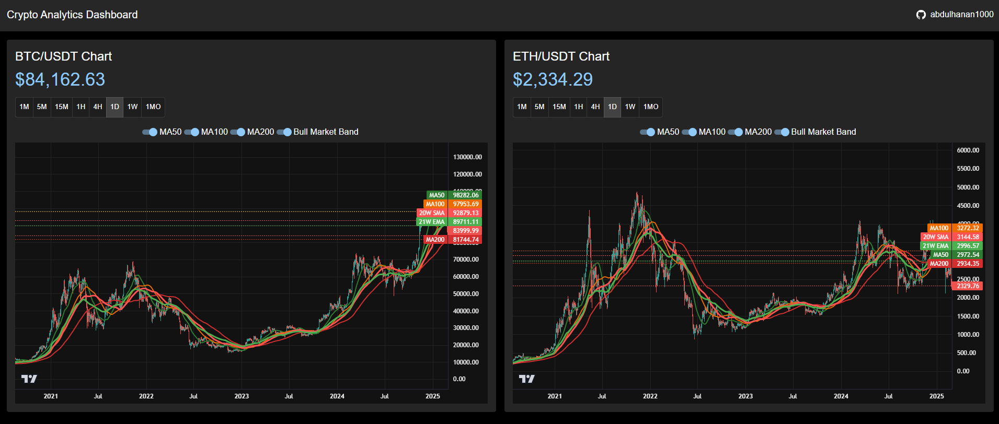

# Crypto Analytics Dashboard

A real-time cryptocurrency dashboard featuring advanced technical analysis tools and indicators. Built with React, TypeScript, and Vite.

## Features

- Real-time price updates for BTC and ETH
- Multiple timeframe analysis (1m to Monthly)
- Technical indicators:
  - Moving Averages (20, 50, 100, 200)
  - Bull Market Support Band (20W SMA & 21W EMA)
- Dark mode interface
- Responsive design

## Technologies Used

- React 19
- TypeScript
- Vite
- Material-UI
- Lightweight Charts
- WebSocket API

## Getting Started

1. Clone the repository
```bash
git clone https://github.com/abdulhanan1000/crypto-BTC-and-ETH-dashboard.git
```

2. Install dependencies
```bash
cd crypto-app
npm install
```

3. Start the development server
```bash
npm run dev
```

## Building for Production

```bash
npm run build
```

## Preview


## Author

- [abdulhanan1000](https://github.com/abdulhanan1000)

## License

MIT
